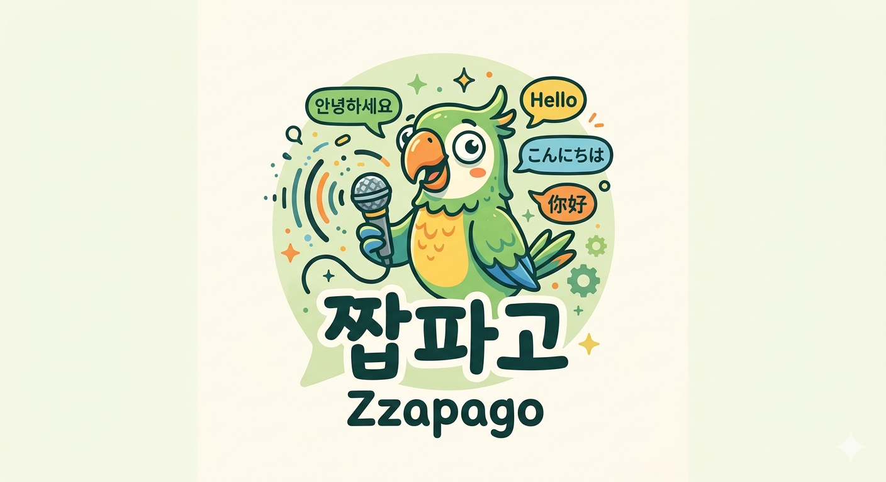
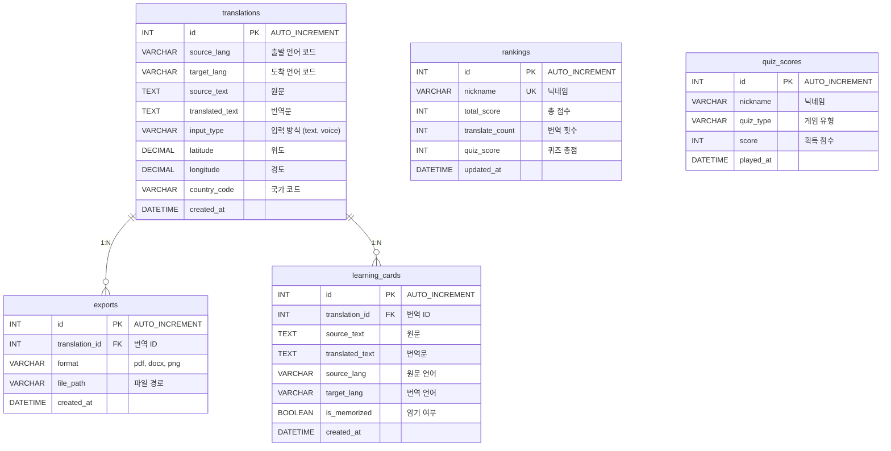

# **프로젝트 : 짭파고 (ZzapPago)** 🌐

<p align="center">
  
</p>

> **특정 목적에 최적화된 프로페셔널 AI 음성 인식 번역 웹 서비스**
>
> 음성 인식 · 실시간 번역 · 텍스트 낭독 · 학습 카드 · 랭킹 시스템까지 올인원 번역 플랫폼

<br>

## 📌 시연 영상

> 🚧 준비 중

<br>

---

## 📋 목차
- [1. 프로젝트 개요](#1-프로젝트-개요)
- [2. 프로젝트 구조](#2-프로젝트-구조)
- [3. 팀 구성 및 역할](#3-팀-구성-및-역할)
- [4. 기술 스택](#4-기술-스택)
- [5. 시작하기 (Getting Started)](#5-시작하기-getting-started)
- [6. 프로젝트 수행 경과](#6-프로젝트-수행-경과)
- [7. 핵심 기능 코드 리뷰](#7-핵심-기능-코드-리뷰)
- [8. 화면 UI](#8-화면-ui)
- [9. 자체 평가 의견](#9-자체-평가-의견)

---

<br>

## 1. 프로젝트 개요

### 1-1. 프로젝트 주제
- AI 기반 음성 인식 및 실시간 번역 웹 서비스 **"짭파고 (ZzapPago)"**

### 1-2. 주제 선정 배경
- 글로벌 소통 수요 증가에 따라 빠르고 정확한 번역 서비스의 필요성 대두
- 기존 번역 서비스의 한계 (범용적 번역만 제공, 특정 목적/상황에 맞는 전문 번역 부재)
- 번역 결과를 학습 자료로 재활용하는 기능의 부재

### 1-3. 기획 의도
- 단순 번역을 넘어 **특정 목적(여행, 비즈니스, 일상 등)에 최적화**된 프로페셔널 번역 제공
- GPS 위치 기반 또는 사용자 직접 설정으로 **언어 자동 감지 및 설정**
- 번역 내역을 기반으로 **학습 카드, 퀴즈, 랭킹** 등 부가 학습 기능 연동
- 번역 결과를 **PDF, Word, PNG(WEBP)** 등으로 내보내기 지원

### 1-4. 핵심 기능
| 구분 | 기능 |
|:---:|:---|
| 🎤 음성 인식 | OpenAI Whisper 기반 STT → 텍스트 변환 → 자동 번역 |
| ⚡ 실시간 번역 | WebSocket 기반 타이핑 중 실시간 번역 (500ms 디바운스) |
| 📝 텍스트 번역 | GPT-4o-mini 기반 고품질 다국어 번역 |
| 📍 위치 기반 | GPS + OpenStreetMap 역지오코딩 → 현지 언어 자동 감지 |
| 📚 번역 내역 | 날짜별 그룹핑 · 유형별 필터 · 번역 기록 관리 |
| 🃏 학습 카드 | 번역 내역 기반 단어 카드 생성 · 암기 상태 관리 |
| 🏆 랭킹 시스템 | 번역 횟수 + 퀴즈 점수 종합 랭킹 (닉네임 기반) |
| 📄 내보내기 | 번역 결과 PDF / Word / PNG 파일 다운로드 |
| 🎮 미니게임 | 짝맞추기 (원문-번역 매칭) · 암기 판별 스와이프 |

### 1-5. 기대효과
- 목적별 맞춤 번역으로 실제 상황에서의 활용도 극대화
- 번역 → 학습 → 랭킹 선순환 구조로 지속적 사용 유도
- PDF/Word 내보내기로 오프라인 학습 자료 확보
- 향후 Flutter 앱 변환 및 MCP 통계 기능 확장 가능

<br>

---

## 2. 프로젝트 구조

### 2-1. 아키텍처

```
+-----------------------------------------------------------+
|                     Client (Browser)                      |
|  +-----------------------------------------------------+  |
|  |            React 19 + Vite 8 + TypeScript 6          | |
|  |                                                      | |
|  |  +------------+ +------------+ +----------+ +------+ | |
|  |  |MediaRecorder|Geolocation | | Axios /  | |Tail- | | |
|  |  |API (녹음)  | |API (GPS)   | |WebSocket | |wind  | | |
|  |  +------------+ +------------+ +----------+ +------+ | |
|  +-----------------------------------------------------+  |
+-----------------------------+-----------------------------+
                              | HTTP / WebSocket
                              v
+-----------------------------------------------------------+
|               Backend (FastAPI 0.115 + Uvicorn)          |
|                                                           |
|  +-----------+ +----------+ +---------+ +--------------+  |
|  | Translate | | STT      | | Ranking | | Export       |  |
|  | API       | | API      | | API     | | (PDF/Word/IMG) |
|  +-----------+ +----------+ +---------+ +--------------+  |
|  +-----------+ +----------+ +---------+                   |
|  | Learning  | | Quiz     | |WebSocket|                   |
|  | Card API  | | Score API| |(실시간) |                   |
|  +-----------+ +----------+ +---------+                   |
|                                                           |
|  +-----------------------------------------------------+  |
|  |              AI API Layer (OpenAI)                  |  |
|  |  +-------------------+ +------------------+         |  |
|  |  | GPT-4o-mini       | | Whisper-1        |         |  |
|  |  | (번역 엔진)        | | (음성 인식 STT)   |         |  |
|  |  +-------------------+ +------------------+         |  |
|  +-----------------------------------------------------+  |
|                                                           |
|  +-----------------------------------------------------+  |
|  |          File Generation Layer                      |  |
|  |  +------------+ +------------+ +-----------+        |  |
|  |  | ReportLab  | | python-    | | Pillow    |        |  |
|  |  | (PDF)      | | docx(Word) | | (PNG)     |        |  |
|  |  +------------+ +------------+ +-----------+        |  |
|  +-----------------------------------------------------+  |
+-----------------------------+-----------------------------+
                              |
                              v
              +----------------------------+
              |         MySQL 8.0          |
              |   (zzappago database)      |
              +----------------------------+
```

### 2-2. 디렉토리 구조

```
ZzapPago/
├── .env.example                       ← 환경변수 예시
├── docker-compose.yml                 ← Docker Compose (3 서비스)
├── developments.md                    ← 개발 일지
├── README.md                          ← 프로젝트 소개
│
├── DB/
│   ├── DDL.sql                        ← 전체 스키마 정의 (5 테이블)
│   ├── translations.sql               ← 번역 내역 테이블
│   ├── exports.sql                    ← 내보내기 이력 테이블
│   ├── rankings.sql                   ← 랭킹 테이블
│   ├── quiz_scores.sql                ← 미니게임 점수 테이블
│   └── learning_cards.sql             ← 학습 카드 테이블
│
├── docs/images/                       ← 문서 이미지 (로고 등)
│
├── backend/                           ← FastAPI 백엔드
│   ├── Dockerfile
│   ├── requirements.txt
│   ├── exports/                       ← 내보내기 파일 저장 디렉토리
│   └── app/
│       ├── main.py                    ← FastAPI 앱 진입점 (라우터 등록 + WebSocket)
│       ├── config/
│       │   ├── settings.py            ← pydantic-settings 환경변수 설정
│       │   └── database.py            ← SQLAlchemy 엔진 / 세션
│       ├── api/v1/
│       │   ├── translate.py           ← 번역 API (POST / GET history)
│       │   ├── stt.py                 ← 음성 인식 API (POST 파일 업로드)
│       │   ├── learning_card.py       ← 학습 카드 API (GET / POST / PATCH)
│       │   ├── quiz_score.py          ← 미니게임 점수 API (POST)
│       │   ├── ranking.py             ← 랭킹 API (GET / POST)
│       │   └── export.py             ← 내보내기 API (POST / GET download)
│       ├── models/
│       │   ├── translation.py         ← Translation 모델
│       │   ├── export.py              ← Export 모델
│       │   ├── ranking.py             ← Ranking 모델
│       │   ├── quiz_score.py          ← QuizScore 모델
│       │   └── learning_cards.py      ← LearningCard 모델
│       ├── schemas/
│       │   ├── translate.py           ← 번역 요청/응답 스키마
│       │   ├── stt.py                 ← STT 응답 스키마
│       │   ├── learning_card.py       ← 학습 카드 스키마
│       │   ├── ranking.py             ← 랭킹/퀴즈 스키마
│       │   └── export.py              ← 내보내기 스키마
│       ├── services/
│       │   ├── translate_service.py   ← GPT-4o-mini 번역 엔진
│       │   ├── stt_service.py         ← Whisper STT 서비스
│       │   ├── learning_card_service.py ← 학습 카드 서비스
│       │   ├── quiz_score_service.py  ← 퀴즈 점수 서비스
│       │   ├── ranking_service.py     ← 랭킹 집계 서비스
│       │   └── export_service.py      ← PDF/Word/IMG 파일 생성
│       └── websocket/
│           └── realtime_translate.py  ← WebSocket 실시간 번역 핸들러
│
└── frontend/                          ← React 프론트엔드
    ├── Dockerfile
    ├── package.json
    ├── vite.config.ts                 ← Vite 빌드 설정 + 프록시 (/api, /ws)
    ├── public/                        ← 정적 파일 (logo.png 등)
    └── src/
        ├── App.tsx                    ← 라우트 정의 (5 페이지)
        ├── main.tsx                   ← React 진입점
        ├── index.css                  ← Tailwind CSS 설정
        ├── api/
        │   ├── translate.ts           ← 번역 API 클라이언트
        │   ├── stt.ts                 ← STT API 클라이언트
        │   ├── learningCard.ts        ← 학습 카드 API 클라이언트
        │   ├── quizScore.ts           ← 퀴즈 점수 API 클라이언트
        │   ├── ranking.ts             ← 랭킹 API 클라이언트
        │   └── export.ts              ← 내보내기 API 클라이언트
        ├── components/
        │   ├── common/
        │   │   ├── Navbar.tsx         ← 네비게이션 바 (모바일 대응)
        │   │   └── ParrotLogo.tsx     ← SVG 앵무새 로고
        │   ├── translate/
        │   │   ├── LanguageSelector.tsx ← 언어 선택 드롭다운
        │   │   ├── TranslateInput.tsx  ← 번역 입력 영역
        │   │   ├── TranslateOutput.tsx ← 번역 결과 영역
        │   │   └── VoiceInput.tsx     ← 음성 녹음 UI (마이크 버튼)
        │   └── game/
        │       ├── MatchGame.tsx      ← 짝맞추기 게임
        │       └── SwipeGame.tsx      ← 암기 판별 게임 (작성 중)
        ├── hooks/
        │   ├── useVoiceRecorder.ts    ← MediaRecorder 녹음 훅
        │   ├── useRealtimeTranslate.ts ← WebSocket 실시간 번역 훅
        │   └── useGeoLocation.ts      ← GPS 위치 감지 + 역지오코딩 훅
        ├── layouts/
        │   └── MainLayout.tsx         ← 공통 레이아웃 (Navbar + Outlet)
        ├── pages/
        │   ├── HomePage.tsx           ← 메인 번역 페이지 (텍스트/실시간/음성 탭)
        │   ├── HistoryPage.tsx        ← 번역 내역 (필터/그룹/내보내기)
        │   ├── LearningCardsPage.tsx  ← 학습 카드 (암기 상태 관리)
        │   ├── GamePage.tsx           ← 미니게임 (짝맞추기/암기 판별)
        │   └── RankingPage.tsx        ← 랭킹 (TOP 3 + 전체 테이블)
        └── utils/
            └── languages.ts           ← 언어 코드/라벨 유틸리티
```

### 2-3. 메뉴 구조도

```
짭파고 (ZzapPago)
├── 🏠 번역 (홈)                           /
│   ├── 📝 텍스트 번역 (기본 탭)
│   ├── ⚡ 실시간 번역 (WebSocket 탭)
│   ├── 🎤 음성 번역 (마이크 녹음 탭)
│   ├── 🌐 언어 선택 (출발어 ↔ 도착어)
│   └── 📍 위치 기반 언어 감지 (GPS 버튼)
│
├── 📚 번역 내역                            /history
│   ├── 유형별 필터 (텍스트/음성/문서/웹사이트)
│   ├── 날짜별 그룹핑 (오늘/어제/날짜)
│   ├── 학습 카드로 저장 버튼
│   └── 내보내기 (PDF / Word / IMG)
│
├── 🃏 학습 카드                            /learning-cards
│   ├── 학습 카드 목록 (원문 ↔ 번역)
│   ├── 암기 전 / 암기 완료 필터
│   └── 암기 상태 토글
│
├── 🏆 랭킹                                /ranking
│   ├── TOP 3 하이라이트 카드
│   └── 전체 랭킹 테이블 (닉네임/총점/번역/퀴즈)
│
└── 🎮 미니게임                             /game
    ├── 짝맞추기 (원문-번역 매칭)
    └── 암기 판별 (스와이프) — 작성 중
```

<br>

---

## 3. 팀 구성 및 역할

| 이름 | 역할 | 담당 기능 |
|:---:|:---:|:---|
| **정성준** | Frontend / Backend | • 텍스트 번역 · 번역 내역 · 텍스트 낭독(TTS)<br>• 학습 카드 · 미니게임 |
| **최영우** | Frontend / Backend | • 음성 인식(STT) · 위치 기반 · 실시간 번역<br>• 내보내기(PDF/Word/IMG) · 랭킹 시스템 |

> 💡 인원 : **2명** &nbsp;|&nbsp; 기간 : **2026.04 ~**

<br>

---

## 4. 기술 스택

### Frontend
<div align="left">
  
  
  
  
  
  
  
  
  
</div>

### Backend
<div align="left">
  
  
  
  
  
  
  
</div>

### AI / STT
<div align="left">
  
  
</div>

### Database
<div align="left">
  
</div>

### File Export
<div align="left">
  
  
  
</div>

### DevOps / Tools
<div align="left">
  
  
  
  
  
  
  
</div>

<br>

---

## 5. 시작하기 (Getting Started)

### 5-0. 사전 설치 필요 프로그램

| 프로그램 | 버전 | 다운로드 |
|:---|:---|:---|
| **Python** | 3.13 이상 | https://www.python.org/downloads/ |
| **Node.js** | 22 이상 | https://nodejs.org/ |
| **MySQL** | 8.0 이상 | https://dev.mysql.com/downloads/ |
| **Git** | 최신 | https://git-scm.com/ |
| **Docker** (선택) | 최신 | https://www.docker.com/ |

> ⚠️ Python 설치 시 **"Add to PATH" 체크 필수**

### 5-1. 프로젝트 클론

```bash
git clone <레포지토리 URL>
cd ZzapPago
```

### 5-2. 환경변수 설정

```bash
copy .env.example .env
```

`.env` 파일을 열어 본인 환경에 맞게 수정:
```env
DB_HOST=localhost
DB_PORT=3306
DB_USER=root
DB_PASSWORD=본인MySQL비밀번호
DB_NAME=zzappago
OPENAI_API_KEY=본인-OpenAI-키
```

### 5-3. MySQL 데이터베이스 생성

```bash
# 1) DDL.sql로 전체 스키마 한번에 생성
mysql -u root -p < DB/DDL.sql
```

또는 수동으로:
```sql
CREATE DATABASE IF NOT EXISTS zzappago
  DEFAULT CHARACTER SET utf8mb4
  DEFAULT COLLATE utf8mb4_unicode_ci;
```
> 테이블은 FastAPI 서버 시작 시 `Base.metadata.create_all()`로 자동 생성됩니다.

### 5-4. Backend 실행

```bash
cd backend
python -m venv venv
venv\Scripts\activate          # Windows
# source venv/bin/activate     # Mac/Linux

pip install -r requirements.txt
uvicorn app.main:app --reload
```

> ✅ http://localhost:8000/docs → Swagger API 문서 확인

### 5-5. Frontend 실행

```bash
# 새 터미널 열고
cd frontend
npm install
npm run dev
```

> ✅ http://localhost:5173 → 짭파고 메인 화면

### 5-6. Docker Compose로 한번에 실행 (선택)

```bash
# 프로젝트 루트에서
docker-compose up --build
```

| 서비스 | 포트 |
|:---:|:---:|
| MySQL (db) | 3307 → 3306 |
| Backend | 8000 |
| Frontend | 5173 |

> ⚠️ 로컬에서 MySQL이 3306을 이미 사용 중이라 Docker DB는 **3307** 포트로 매핑됩니다.

<br>

---

## 6. 프로젝트 수행 경과

### 5-1. 요구사항 & 기능 정의서
<details>
  <summary>요구사항 및 기능 정의서 펼치기</summary>
  
  > 🚧 준비 중
</details>

### 5-2. ERD
<details>
  <summary>ERD 펼치기</summary>


</details>

### 5-3. API 명세서
<details>
  <summary>API 명세서 펼치기</summary>

#### 번역 (Translate)
| Method | Endpoint | 설명 |
|:---:|:---|:---|
| `POST` | `/api/v1/translate/` | 텍스트 번역 (GPT-4o-mini) |
| `GET` | `/api/v1/translate/history` | 번역 내역 조회 |

#### 음성 인식 (STT)
| Method | Endpoint | 설명 |
|:---:|:---|:---|
| `POST` | `/api/v1/stt/transcribe` | 음성 파일 → 텍스트 변환 (Whisper) |

#### 학습 카드 (Learning Card)
| Method | Endpoint | 설명 |
|:---:|:---|:---|
| `GET` | `/api/v1/learning-cards/` | 학습 카드 목록 조회 |
| `POST` | `/api/v1/learning-cards/` | 학습 카드 생성 |
| `PATCH` | `/api/v1/learning-cards/{id}/memorize` | 암기 상태 토글 |

#### 미니게임 점수 (Quiz Score)
| Method | Endpoint | 설명 |
|:---:|:---|:---|
| `POST` | `/api/v1/quiz-scores/` | 게임 점수 저장 |

#### 랭킹 (Ranking)
| Method | Endpoint | 설명 |
|:---:|:---|:---|
| `GET` | `/api/v1/rankings/` | 전체 랭킹 조회 (총점 내림차순) |
| `POST` | `/api/v1/rankings/translate` | 번역 횟수 +1 반영 |
| `POST` | `/api/v1/rankings/quiz` | 퀴즈 점수 합산 반영 |

#### 내보내기 (Export)
| Method | Endpoint | 설명 |
|:---:|:---|:---|
| `POST` | `/api/v1/exports/` | PDF / Word / IMG 파일 생성 |
| `GET` | `/api/v1/exports/download/{id}` | 생성된 파일 다운로드 (FileResponse) |

#### WebSocket
| Protocol | Endpoint | 설명 |
|:---:|:---|:---|
| `WS` | `/ws/translate` | 실시간 번역 (JSON: text, source_lang, target_lang) |

</details>

<br>

---

## 7. 핵심 기능 코드 리뷰

### 7-1. 음성 인식 → 자동 번역 파이프라인

> 마이크 녹음 → Whisper STT → GPT-4o-mini 번역까지 원스톱 처리

**Backend: `stt_service.py`** — OpenAI Whisper API 호출
```python
async def transcribe_audio(file: UploadFile, language: str | None = None) -> str:
    """OpenAI Whisper API를 사용하여 음성 파일을 텍스트로 변환한다."""
    client = OpenAI(api_key=settings.OPENAI_API_KEY)
    audio_bytes = await file.read()

    transcription = client.audio.transcriptions.create(
        model="whisper-1",
        file=(file.filename or "audio.webm", audio_bytes),
        language=language,
    )
    return transcription.text
```

**Frontend: `useVoiceRecorder.ts`** — MediaRecorder로 브라우저 녹음 후 STT API 호출, 결과 텍스트를 자동으로 번역 API에 전달하여 원스톱 번역 파이프라인 구성.

---

### 7-2. WebSocket 기반 실시간 번역

> 타이핑 중 500ms 디바운스 → WebSocket으로 GPT-4o-mini 번역 → 즉시 응답

**Backend: `realtime_translate.py`**
```python
async def handle_realtime_translate(websocket: WebSocket):
    await websocket.accept()
    client = OpenAI(api_key=settings.OPENAI_API_KEY)

    while True:
        data = await websocket.receive_json()
        text = data.get("text", "").strip()
        source_lang = data.get("source_lang", "ko")
        target_lang = data.get("target_lang", "en")

        response = client.chat.completions.create(
            model="gpt-4o-mini",
            messages=[
                {"role": "system", "content": f"Translate from {source_name} to {target_name}. Return ONLY the translated text."},
                {"role": "user", "content": text},
            ],
            temperature=0.3,
        )
        await websocket.send_json({
            "translated_text": response.choices[0].message.content.strip(),
            "source_text": text,
        })
```

**Frontend: `useRealtimeTranslate.ts`** — 500ms 디바운스 훅
```typescript
const sendText = useCallback((text: string) => {
  if (timerRef.current) clearTimeout(timerRef.current);
  timerRef.current = setTimeout(() => {
    if (wsRef.current?.readyState === WebSocket.OPEN) {
      wsRef.current.send(JSON.stringify({
        text, source_lang: sourceLang, target_lang: targetLang,
      }));
    }
  }, debounceMs);  // 기본 500ms
}, [sourceLang, targetLang, debounceMs]);
```

---

### 7-3. GPT-4o-mini 번역 엔진 + 위치 기반 언어 감지

> GPT-4o-mini 프롬프팅으로 전문 번역 수행, GPS 좌표에서 국가 코드 추출 후 자동 언어 설정

**Backend: `translate_service.py`** — 번역 + 위치 정보 저장
```python
def translate_text(req: TranslateRequest, db: Session) -> TranslateResponse:
    client = OpenAI(api_key=settings.OPENAI_API_KEY)
    response = client.chat.completions.create(
        model="gpt-4o-mini",
        messages=[
            {"role": "system", "content": f"You are a professional translator. Translate from {source_name} to {target_name}. Return ONLY the translated text."},
            {"role": "user", "content": req.text},
        ],
        temperature=0.3, max_tokens=2000,
    )
    # DB에 번역 내역 + 위치 정보 함께 저장
    record = Translation(
        ...,
        latitude=req.latitude,
        longitude=req.longitude,
        country_code=req.country_code,
    )
    db.add(record)
    db.commit()
```

**Frontend: `useGeoLocation.ts`** — GPS → 역지오코딩 → 언어 매핑
```typescript
// 1) 브라우저 Geolocation API로 GPS 좌표 획득
const position = await new Promise<GeolocationPosition>((resolve, reject) => {
  navigator.geolocation.getCurrentPosition(resolve, reject, {
    enableHighAccuracy: true, timeout: 10000,
  });
});
// 2) OpenStreetMap Nominatim 역지오코딩 → 국가 코드
const res = await fetch(`https://nominatim.openstreetmap.org/reverse?lat=${lat}&lon=${lon}&format=json&zoom=3`);
countryCode = data?.address?.country_code?.toUpperCase();
// 3) 26개국 매핑 테이블로 언어 자동 설정
langCode = COUNTRY_LANG_MAP[countryCode];  // KR→ko, US→en, JP→ja ...
```

---

### 7-4. 번역 내역 → 학습 카드 생성

> 번역 내역 페이지에서 원문/번역문 쌍을 학습 카드로 저장, 암기 상태 관리

번역 내역 (HistoryPage) → "학습 카드로 저장" 버튼 클릭 → `POST /api/v1/learning-cards/` 호출 → `learning_cards` 테이블에 원문/번역문/언어 정보 저장. 학습 카드 페이지에서 암기 전/암기 완료 토글 (`PATCH /api/v1/learning-cards/{id}/memorize`).

---

### 7-5. 파일 내보내기 (PDF / Word / IMG)

> ReportLab (PDF), python-docx (Word), Pillow (PNG)로 번역 결과를 파일로 생성

**Backend: `export_service.py`** — PDF 생성 예시
```python
def export_as_pdf(translation: Translation) -> str:
    from reportlab.pdfgen import canvas
    from reportlab.pdfbase.ttfonts import TTFont

    # 한글 폰트 자동 감지 (Windows/Linux/macOS)
    font_paths = [
        "C:/Windows/Fonts/malgun.ttf",
        "/usr/share/fonts/truetype/nanum/NanumGothic.ttf",
        "/System/Library/Fonts/AppleGothic.ttf",
    ]
    # A4 캔버스에 원문/번역문 렌더링
    c = canvas.Canvas(filepath, pagesize=A4)
    c.drawString(2*cm, height-6.5*cm, "[원문]")
    c.drawString(2*cm, height-10*cm, "[번역]")
    c.save()
```

Word(`python-docx`)와 IMG(`Pillow`)도 동일한 패턴으로 번역 결과를 포매팅하여 파일 생성. `POST /api/v1/exports/`로 생성 요청 후 `GET /api/v1/exports/download/{id}`로 `FileResponse` 다운로드.

<br>

---

## 8. 화면 UI

> 🚧 개발 진행 후 스크린샷 업데이트 예정

<br>

---

## 9. 자체 평가 의견

> 🚧 프로젝트 완료 후 작성 예정

<br>

---

## 🔮 향후 확장 계획
 
| 단계 | 내용 |
|:---:|:---|
| **옵션 1** | MCP 함수 연동 — 번역 통계 및 분석 함수 서버 구축 |
| **옵션 2** | Flutter 앱 변환 — 모바일 네이티브 앱 배포 |
| **Phase 2** | 회원 시스템 — 회원가입/로그인, 소셜 로그인(Google/Kakao) |
| **Phase 3** | 유료 회원 시스템 — 학습 카드, 프리미엄 번역 모델 |
| **Phase 4** | 랭킹 리워드 — 상위 랭커 혜택 시스템 |